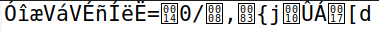

# Week 10 - Secret Key Encription

// missing stuff


## Task 1 -> Frequency Analysis:

> executing *./freq.py* we get:

```console
-------------------------------------
1-gram (top 20):
g: 488
z: 373
u: 348
j: 291
y: 280
m: 276
v: 264
q: 235
h: 183
b: 166
f: 156
s: 116
t: 104
c: 95
p: 90
n: 83
x: 83
a: 82
w: 76
r: 59
-------------------------------------
2-gram (top 20):
zh: 115
hg: 89
vy: 74
gq: 58
uq: 57
qg: 57
uy: 56
gm: 53
jy: 52
yf: 46
jq: 45
zg: 44
gf: 44
uz: 44
gy: 42
mz: 39
um: 33
ub: 32
ng: 32
su: 31
-------------------------------------
3-gram (top 20):
zhg: 78
uyf: 30
vya: 20
zgq: 18
jcz: 16
vjy: 14
ngm: 14
zhu: 13
gmz: 13
ubb: 13
xjq: 13
pum: 12
gyz: 12
uzg: 12
yuz: 11
pvy: 11
guq: 11
tvy: 11
hvm: 10
uqf: 10
``` 

- To better keep track of our decrypting, we use the txt file with all the letters in lowercase *lowscase.txt*, and the letters we substitute will be in upper case.

- According to english language, 'e' is the most common single letter, 'th' is the most common bigram and, 'the' is the most common trigram.

- This strongly suggest that in our ciphered text 
  - g -> e, zh -> th, zhg-> the; z = t, h = h, g = e.

```console
tr 'zhg' 'THE' <lowscase.txt> out.txt
```

// show the change in out.txt 

- Since g and z are accounted for, the next more frequent char is the letter 'a', so we will assume for now that
  - u-> a

```console
tr 'u' 'A' <out.txt> out1.txt
```

// show the change in out1.txt

- In the current text, with the letters already deciphered, we see various instances of 'THAy', since y is not deciphered, it can't be the word 'THAT' so the next most frequent one would be 'THAN', so we are presuming that
  - y -> n

```console
tr 'y' 'N' <out1.txt> out2.txt
```

- We know the second most frequent trigram is 'uyf', since we assume we know 'u' and 'y', we get 'ANf' and arguably the most common trigram with 'AN' in the beginning would be the word 'AND'
  - f -> d

```console
tr 'f' 'D' <out2.txt> out3.txt
```

- We have the word 'vNTENDED', the possible words would be either 'UNTENDED' or 'INTENDED', and since the letter 'i' is more frequent in the english language, we will for now assume
  - v -> i

```console
tr 'v' 'I' <out3.txt> out4.txt
```

- We have the words 'pHETHEq' 'THEqE', the most common word with 'THE_E' would be 'THERE' so lets make q -> e, and now the first word becomes 'pHETER', and the only word with 5 letter ending in 'HETER' is 'WHETER'
  - p->w

```console
tr 'pq' 'WR' <out4.txt> out5.txt
```

- We have the words 'INmTEAD' 'AWARDm' being that the letter missing is the same, the only letter possible to complete those words is 's'
  - m->s

```console
tr 'm' 'S' <out5.txt> out6.txt
```

- We have the word 'TcRNS', the only possible letters for 'c' would be either 'u', 'a', 'e', but since we already have the letters equivalent to 'a' and 'e', the only option is that the letter 'c' is the ciphered 'u'
  - c -> u

```console
tr 'c' 'U' <out6.txt> out7.txt
```

- We have the word 'SwEARHEADED', the only word fitting that would be SPEARHEADED, so w -> p, with this, the words 'SUwwjRTERS'; 'SUwwjRT' become 'SUPPwRTERS' and 'SUPPwRT', meaning that most likely those words are 'SUPPORTERS' and 'SUPPORT'
  - j->o

```console
tr 'wj' 'po' <out7.txt> out8.txt
```

- We have the following phrase: 'AS IT TURNS OUT AT bEAST IN TERtS Ox THE OSsARS IT PROnAnbr WONT nE', this most likely deciphered says: 'AS IT TURNS OUT AT LEAST IN TERMS OF THE OSCARS IT PROBABLY WONT BE'
so we can assume an array of letters just from the phrase:
  - b->l ; t->m ; x-> f ; n->b ; r->y  *(All letter that are not still defined in our deciphered text)*

```console
tr 'btxnr' 'LMFBY' <out8.txt> out9.txt
```

- Lets look at the first paragraph : 'THE OSsARS TURN  ON SUNDAY WHIsH SEEMS ABOUT RIaHT AFTER THIS LONa STRANaE AWARDS TRIP THE BAaaER FEELS LIlE A NONAaENARIAN TOO', while analyzing this phrase, we conclude that these might be the deciphered letters:
  - s->c ; a->g ; l->k

```console
tr 'sal' 'CGK' <out9.txt> out10.txt
```

- 'HARiEY WEINSTEIN' probably refers to Harvey Weinstein so:
  - i->v

```console
tr 'i' 'v' <out10.txt> out11.txt
```

- With a quick search on google, we were able to find the [corresponding article in the *nytimes* website](https://www.nytimes.com/2018/03/01/movies/oscars-sunday-what-to-expect.html)
  - Comparing the article with the text we currently have we conclude that the missing deciphered letters are:
        - d->x  ; e->q ; k->j ; o->z

```console
tr 'deko' 'XQJZ' <out11.txt> out12.txt
```

- And with that we have solved the ciphered text!


## Task 2 -> Encryption using Different Ciphers and Modes:

This tasks focuses on the interaction with different ciphers and modes.

### Cipher

> Also called encryption algorithms, are systems for encrypting and decrypting data. A cipher converts the original message, called plaintext, into ciphertext using a key to determine how its done.

After a quick research, the most common encryption modes are:
- Block Mode
- Stream Mode

### Block Mode

> Method of encryption in which the message is broken into blocks and the encryption occurs on each block as a unit.

### Stream Mode

> Method of encryption in which each individual byte is encrypted. Generally considered to be a weak form  of encryption


### Trying 3 different Cyphers

Firstly we made a new file `plaintext.txt` with the following message:

```text
This is but a secret test
```

Following the Lab Guide, we used the following command to obtain our 3 different cyphers, changing the `-ciphertype` to the encryption method we decide to use

```console
$ openssl enc -ciphertype -e -in plain.txt -out cipher.bin -K 00112233445566778889aabbccddeeff -iv 0102030405060708
```

The three ciphers we used (the ones provided in the lab) were:

- `-aes-128-cbc` -> Advanced Encryption Standard, 128 bits in size, Mode = Cipher Block Chaining
- `-bf-cbc` -> Blowfish, Mode = Cipher Block Chaining
- `-aes-128-cfb` -> Advanced Encryption Standard, 128 bits in size, Mode = Cipher Feed Back

The results were the following:

| Cipher | Mode | Encrypted |
|--------|----------|-----------|
| [128-bit AES](https://en.wikipedia.org/wiki/Advanced_Encryption_Standard) | Cipher Block Chaining | |
| [Blowfish](https://en.wikipedia.org/wiki/Blowfish_(cipher)) | Cipher Block Chaining|  |
| [128-bit AES](https://en.wikipedia.org/wiki/Advanced_Encryption_Standard) | Cipher Feed Back|  |


## Task 3 -> Encryption Mode - ECB vs CBC:

The Final Task for Evaluation is related to encrypting an image, provided by the LabSetup from `Seed-Labs`

We are asked to encrypt the file using:

### ECB

> Electronic Code Book is a simple mode of operation with a block cipher that is mostly used with symmetric key encryption. It's a straightforward way of processing a series of sequentially listed message blocks.

 

#### Pros :

- Faster
- Easier
- Parallel encryption of particular blocks of bits is possible or feasible

#### Cons :

- Leaks data about the underlying message being encrypted
- Eavesdropper can identify identical blocks and make guesses about the original plaintext
- Prone to cryptanalysis since there is a direct or straight relationship between plaintext and ciphertext

### CBC

> Cipher Block Chaining is a mode of operation for a block cipher that hides away patterns in the plaintext, achieving this by XOR-ing the first block with an initialization vector before encrypting it. This is chained as every subsequent plaintext block is XOR-ed with the ciphertext of the previous block.


#### Pros :

- Works well for input greater than b bits
- Best authentication mechanism
- Better resistive nature towards cryptanalysis

#### Cons :

- Parallel encryption is not possible since every encryption requires the previous cipher of the cryptography

<br>

### The image provided for encryption is the following:


> **_Info_**: The first 54 bytes of a *.bmp* file contain the header information about the picture, therefore we need to set it correctly, so that the encrypted file can be treated as a legitemate *.bpm*. To achieve this, we replaced the header of the encrypted picture with that of the original picture.

- Solution for the Header Problem

```console
$ head -c 54 pic_original.bmp > header
$ tail -c +55 pic_encrypted.bmp > body 
$ cat header body > new_pic.bmp
```

#### ECB Mode

Using the `openssl enc` command from the task before, we encrypt the original pic, using ECB Mode

```console
$ openssl enc -aes-128-ecb -e -in pic_original.bmp -out pic_encrypted.bmp -K 00112233445566778889aabbccddeeff 
```

We then apply the Solution for the Header Problem mentioned above, and our result is:


Comparing the original pic with the one encrypted using ECB, we can still distinguish very well what the image portrays, like the ellipse and the rectangle, even if they are in a different color. It's rather easy to discern the patterns shown on the encrypted picture, just as if it was the original. Confirming what was written above about the [Electronic Cipher Book](#ecb).


#### CBC Mode

Using the `openssl enc` command from the task before, we encrypt the original pic, using ECB Mode

```console
$ openssl enc -aes-128-cbc -e -in pic_original.bmp -out pic_encrypted.bmp -K 00112233445566778889aabbccddeeff -iv 0102030405060708
```

> *NOTE* : in the CBC Mode we need to use **_-iv_**, i.e. Initialization Vector, to prevent having the same plaintext result in the same (guessable) ciphertext
We then apply the Solution for the Header Problem mentioned above, and our result is:


Comparing the original pic with the one encrypted using CBC, this time we can hardly discern anything that's present in the picture, appearing to the naked eye to be just a static picture. Further proving that this method is a more secure way of encrypting rather than using ECB, as mentioned in the [Cipher Block Chaining](#cbc) section.


### Encrypting a Picture of our choice

- As indicated in the end of the task, we were challenged to repeat the experiment but with a picture of our choice

| Encryption Mode | Result | Conclusion |
|------|---------|-------------------------|
| *None* |  | - |
| ECB    |  | We can still discern the general shape of the image, easily identifying *pikachu*, even if the colors do not math |
| CBC  |  | No pattern are discerned. We cannot identify any resemblance to the original picture, being that this one is just an image of static|


- With this repeated experiment we concluded that our previous statements were correct and that the encryption results end up being similar, regardless of the picture.